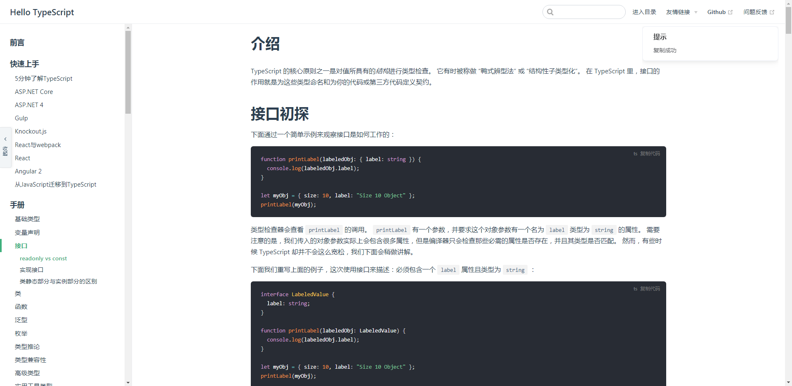

## 掘金风格代码块复制



在社区虽然已经有代码复制块的插件了，但是风格不太喜欢所以动手实现了一个，灵感来源于掘金社区以及 element

## 使用方法

```sh
npm i vuepress-plugin-nuggets-style-copy
# or
yarn i vuepress-plugin-nuggets-style-copy
```

- config.js

```js
module.exports = {
  // .. 省略
};
plugins: [
  // .. 省略
  [
    "vuepress-plugin-nuggets-style-copy",
    {
      copyText: "复制代码",
      tip: { content: "复制成功" }
    }
  ]
];
```

## api

#### selector

选择器，默认为`div[class*="language-"] pre`

#### copyText

复制代码块显示的文字，默认为`Copy code`

#### change

`change: (text:string, e:HTMLelement) => void`
当复制发生变化时的回调函数，`text`是代码块复制的文字或者是失败提示，`e`是组件元素本身的属性，你可以在此基础上实现一些高级的定制功能(`this`为当前组件)

#### visibleTip

是否展示代码复制后默认提示，默认为`true`

#### tip

- time

复制成功后提示默认展示的时间，默认为`3000`，如果为`Infinity`则是无限制

- content

复制成功后的提示内容，默认为`copy success`

- title

复制成功后的标题，默认为`Tips`

## 协议

[MIT](/License)
