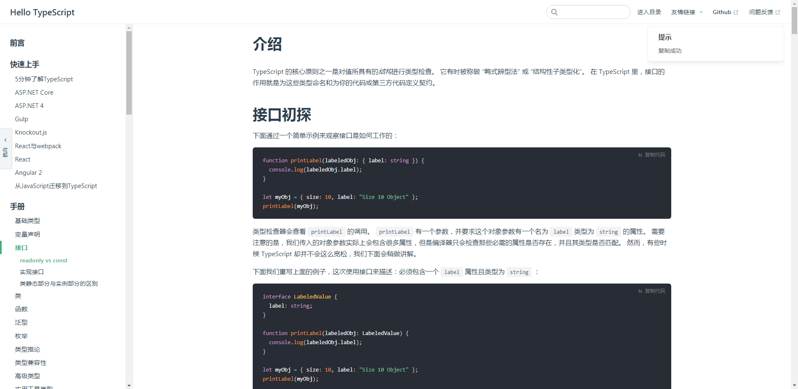

## Nuggets style code block replication



Although there are plug-ins for code replication block in the community, I don't like the style very much, so I implemented one by myself. The inspiration comes from the gold digging community and element

[中文文档](/README-ZH.md)

## How to use

```sh
npm i vuepress-plugin-nuggets-style-copy
# or
yarn i vuepress-plugin-nuggets-style-copy
```

- config.js

```js
module.exports = {
  //. omitted
};
plugins: [
  //. omitted
  ["vuepress-plugin-nuggets-style-copy"]
];
```

## api

#### selector

Selector, default to `div[class*="language-"] pre`

#### copyText

Copy the text displayed in the code block, the default is `copy code`

#### change

`change: (text:string, e:HTMLelement) => void`
When copying changes, the callback function, `text` 'is the code block copy text or failure prompt, `e` is the attribute of the component element itself. You can implement some advanced customization functions on this basis (`this` is the current component)

#### visibleTip

Display the default prompt after code copying. The default is `true`

#### tip

- time
  After copying successfully, the display time will be prompted by default, which is `3000` . If it is `infinity`, it is unlimited
- content
  The prompt content after copying successfully. The default is `copy success`
- title
  Title after copying successfully, default is `tips`

## Agreement

[MIT](/License)
