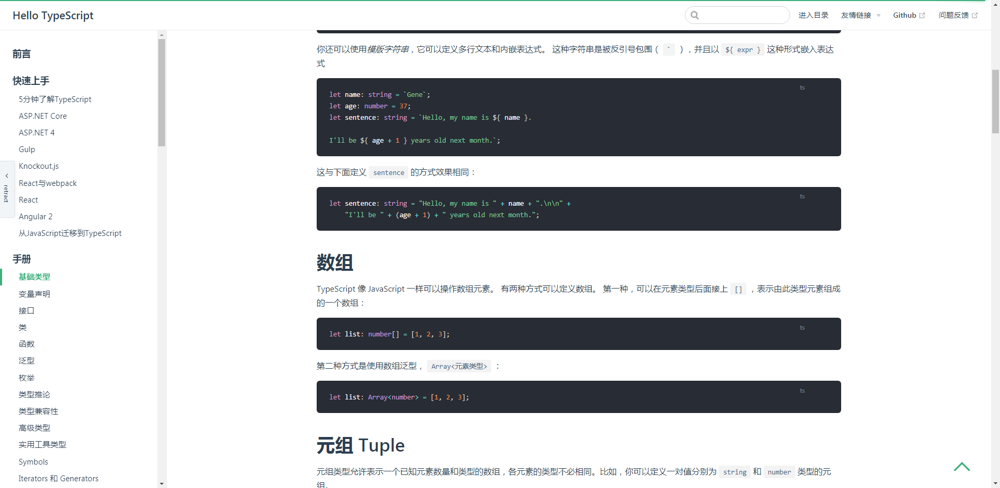

## 菜单展开/收起



对于一些表格字段过长，小屏幕体验不是特别好，所以心血来潮做了一个菜单展开收起的功能，给予屏幕更多的空间，注：在移动屏幕下这个插件不会加载

## 使用方法

```sh
npm i vuepress-plugin-sider-open
# or
yarn i vuepress-plugin-sider-open
```

- config.js

```js
module.exports = {
  // .. 省略
};
plugins: [
    // .. 省略
  [
    "vuepress-plugin-sider-open",
    {
      openText: "展开",
      retractText: "收起"
    }
  ]
];
```

## api

| 名称        | 类型   | 默认值  | 描述           |
| ----------- | ------ | ------- | -------------- |
| openText    | string | open    | 展开字段的名称 |
| retractText | string | retract | 收起字段的名称 |

## 协议

[MIT](/License)
