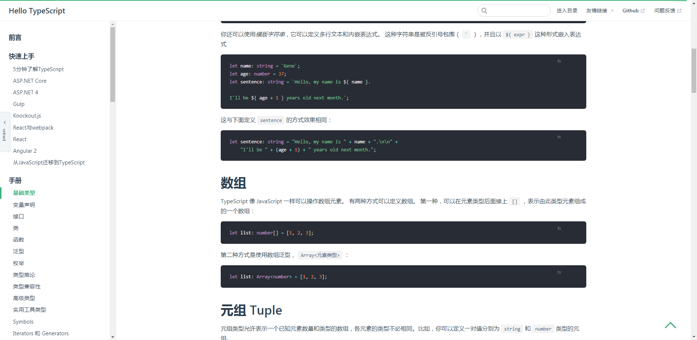

## Menu expand / collapse


[中文文档](/README-ZH.md)

For some table fields that are too long, the small screen experience is not particularly good, so I made a sudden move to expand the function of folding up a menu and give more space to the screen. Note: this plug-in will not load under the mobile screen

## How to use

```sh
npm i vuepress-plugin-sider-open
# or
yarn i vuepress-plugin-sider-open
```

- config.js

```js
module.exports = {
  //. omitted
};
plugins: [
  //. omitted
  [
    "vuepress-plugin-sider-open",
    {
      Opentext: "expand",
      Retracttext: "put up"
    }
  ]
];
```

## api

| Name        | type   | default value | description                       |
| ----------- | ------ | ------------- | --------------------------------- |
| Opentext    | string | open          | name of the expanded field        |
| Retracttext | string | retract       | name of the field to be retracted |

## Agreement

[MIT](/License)
